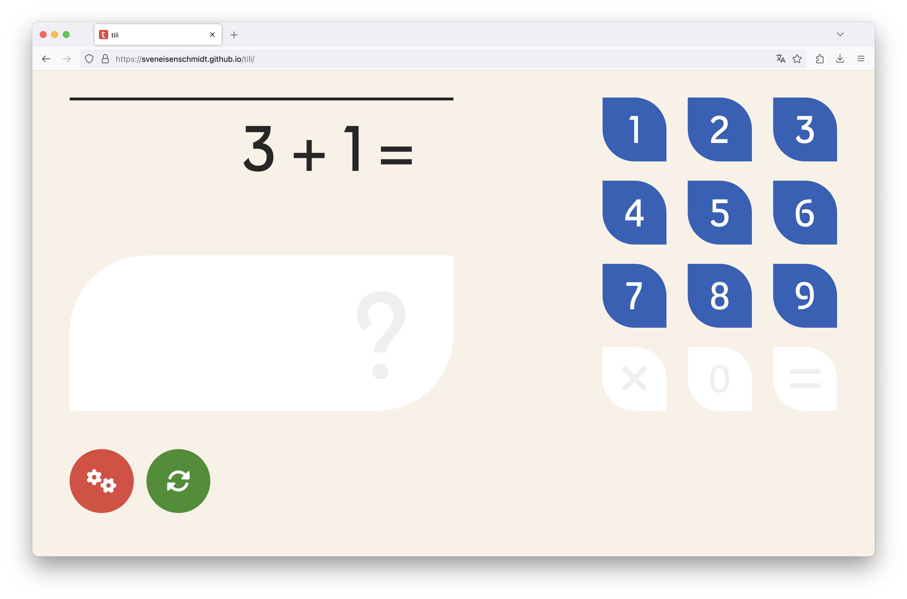
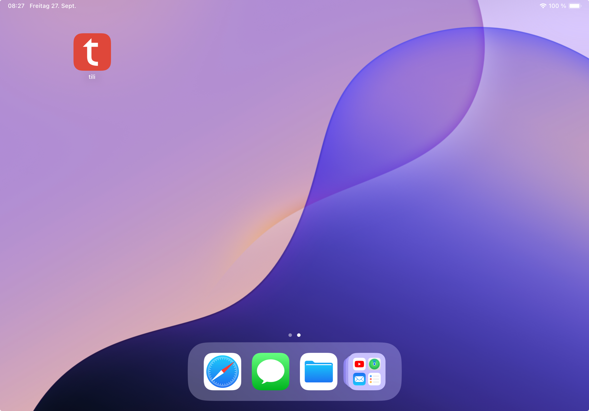

<div align="center">
    
    <h3><i>tili</i></h3>
</div>

## About

Welcome to the math learning app **tili**! This open-source application is designed to help first graders learn addition and subtraction in a straight forward way. With customizable settings, you can tailor learning experience to meet each child's individual learning level.

<div align="center">
    
</div>

### Features

- **Addition and Subtraction:** Children can practice basic arithmetic operations.
- **Customizable Values:** Set minimum and maximum values to adjust the difficulty level.
- **Multiples of a Number:** Allow only multiple of a number like 2,3 or 4
- **Open Source:** The code is available on GitHub for anyone to view and improve. Self-host it if you want.
- **No Tracking, No Ads, No Backend** The app does not communicate with any other servvice, it does not require a backend and is eventually only a HTML page with CSS and JavaScript.

## How to get it

You do not need install the app, it is publicly availble hosted as a static GitHub page under<br/> <a href="https://sveneisenschmidt.github.io/tili/">sveneisenschmidt.github.io/tili/</a>

**Important**: **tili** is optimized for tablets and the design will automatically scale to a landscape orientied screen. It won't work well on mobile phones or computer screens taht are too small. Why's that? The calculations creen and number pad need to be both visible to provide a good experience, that jsut don't work on portair oriented or too small screens.

It is suggested to add **tili** to your homescreen as a bookmark, how to do this? Check here:

- <a href="https://support.apple.com/en-US/guide/shortcuts/apd735880972/ios">Add a shortcut to the Home Screen on iPhone or iPad</a>
- <a href="https://support.google.com/chrome/answer/9658361?hl=en&co=GENIE.Platform%3DAndroid">Use web apps - Google Chrome on Android</a>

<div align="center">
    
</div>

## Self-Hosting

For power users, you can self-host **tili** by cloning the repository and hosting it yourself. The `dist` folder includes a pre-build website, it does not require a backend or external services. From here you decide what is your prefered self-shoting method, you got this champ.

## Development

**tili** is open source, you can download and extend it to your preference. Clone the repository, install dependencies and run the dev server to get started.

```sh
git clone https://github.com/sveneisenschmidt/tili.git
cd tili

npm install

npm run dev
```

Check the `package.json` file to see available commands like running unit or end to end tests, building the static package and many more.

<hr/>

### License

Distributed under the MIT License. See `LICENSE.txt` for more information.

### Acknowledgments

Credits go to:

- [Baumans Font](https://fonts.google.com/specimen/Baumans)
- [GitHub Pages](https://pages.github.com)
- [Font Awesome](https://fontawesome.com)
